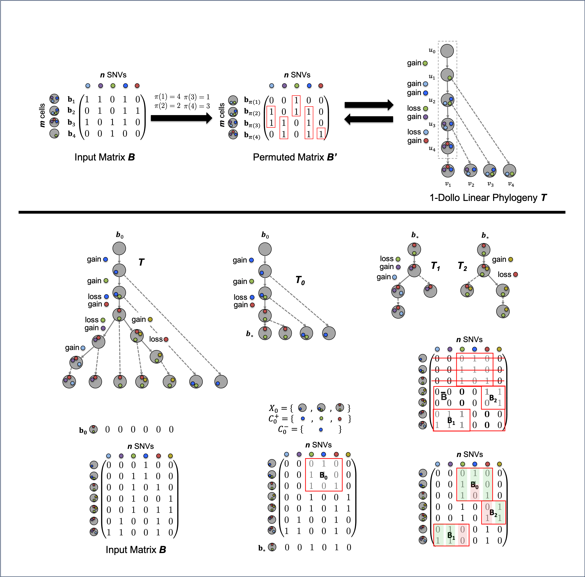

# Dolphyin - inferring 1-Dollo, or persistent, phylogenies from single cell SNV sequencing data

Dolphyin takes in a binary matrix of single cell SNV sequencing data and outputs a 1-Dollo phylogeny on this data, or a rooted tree on which each character / SNV is gained and lost at most once. Underlying Dolphyin is a theoretical characterization and decomposition of all data matrices admitting a 1-Dollo phylogeny, which is turn stems from recursively breaking 1-Dollo phylogenies into 1-Dollo linear phylogenies characterizable with the consecutive ones property.



Dolphyin can also probabilistically account for false negatives in data and can thus be applied to real data. We also include source code (check-FN.cpp) that, given any phylogeny inferred by Dolphyin, will calculate the phylogeny's false-negative rate and provide a .txt file of the tree's [Graphviz](https://graphviz.org/) visualization.

## Contents

  1. [Getting started](#start)
     * [Dependencies](#dep)
     * [Compilation](#comp)
  2. [Usage instructions](#usage)
     * [I/O formats](#io)
     * [Example](#example)

     
<a name="start"></a>
## Getting started

Dolphyin is implemented in C++. If using Dolphyin, we recommend checking out only src, as input and output contain several thousand files of data.

| Folder    | DESCRIPTION                                                  |
| --------- | ------------------------------------------------------------ |
| `src`     | source code for Dolphyin                                     |
| `input`   | simulated data with errors, based on simulations in SPhyR (El-Kebir (2018)) and real data from an acute myeloid leukemia cohort (Morita et. al (2020)) |re                             
| `output`| results on error-free simulations, simulations with error, and real data |re

<a name="dep"></a>

### Dependencies   

Dolphyin has the following dependencies:

* [C++](https://en.cppreference.com/w/cpp/11) (>= 11)

<a name="comp"></a>
### Compilation

To compile Dolphyin in C++, execute the following commands from the root of the repository:

    $ g++ -std=c++11 src/run-Dolphyin.cpp -o src/run-Dolphyin.o

To compile the additional check-FN in C++, execute the following commands from the root of the repository:

    $ g++ -std=c++11 src/check-FN.cpp -o src/check-FN.o

<a name="usage"></a>
## Usage Instructions

<a name="io"></a>
### I/O formats
The input to Dolphyin is a .csv or .txt file that, after two lines which denote the number of m cells and n sequenced SNVs, contains m rows and n columns where m is the the number of single cells and n is the number of mutations. All entries in the .csv file should be either 1 if SNV j is present in cell i and 0 otherwise. Dolphyin's second parameter is a .txt file location to which it will write the clades of the returned 1-Dollo phylogeny. Lastly, Dolphyin takes in parameters p, e, and seed for error correction. p denotes the percentage of row pairs to randomly consider for error correction, e denotes the normalized Hamming distance that each row pair must be under in order to correct both by replacing each with their bitwise OR, and seed is a randomness seed for this error correction.

The input to check-FN is a .csv or .txt file of the original data, the .txt file of Dolphyin's output tree, a .txt file to which the false negative count and false negative rate is written, and an optional .txt file to which a Graphvis tree visualization will be written.


```
Usage:
  ./src/run-dolphyin.o
     [-input str] [-output-dolphyin-tree str] [-p double] [-k double] [-seed int]
  ./src/check-FN.o
     [-input str] [-dolphyin-tree str] [-output-FN str] *[-output-graphviz str]

```
<a name="example"></a>
## Example
The following is an example of how to use Dolphyin.

```
./src/run-dolphyin.o input/sims/errors/m25_n25_s1_k1_loss0.1.txt output-m25_n25_s1_k1_loss0.1.txt 0.25 0.00 1

```